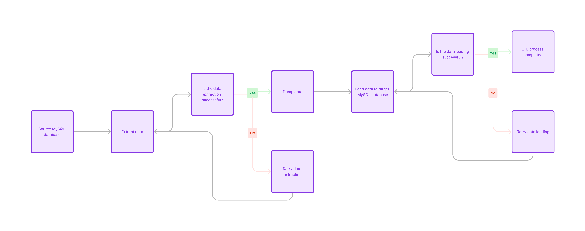

# Basic ETL Project

This project is a basic Extract, Transform, Load (ETL) system implemented with Docker Compose. It sets up two MySQL databases (source and target) and uses a Python script to extract data from the source database and load it into the target database.



## Getting Started

To get started with this project, follow these steps:

1. **Clone the repository:**

   ```bash
   git clone https://github.com/ElhoubeBrahim/etl-project.git
   ```

2. **Navigate to the project directory:**

   ```bash
   cd etl-project
   ```

3. **Start the Docker containers:**

   ```bash
   docker compose up -d
   ```

This command launches the source and target MySQL containers in the background, along with a container that executes the Python ETL script. It also creates a network to facilitate communication between the containers.

## Cleanup

To stop and remove the Docker containers created by this project, use the following command:

```bash
docker-compose down
```

This command halts and deletes the containers, as well as the network they were using.